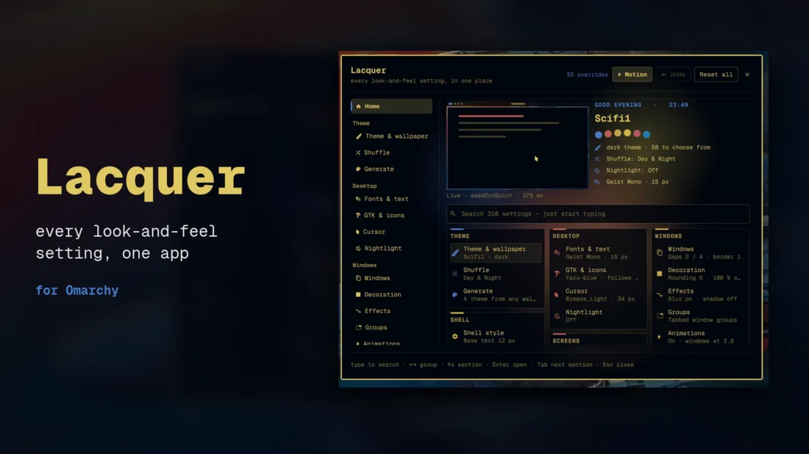
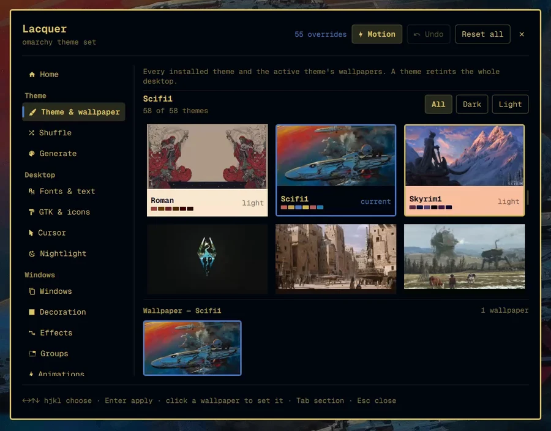
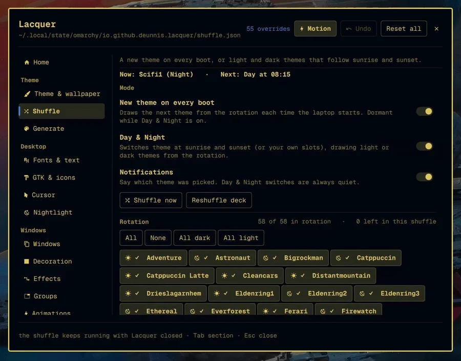
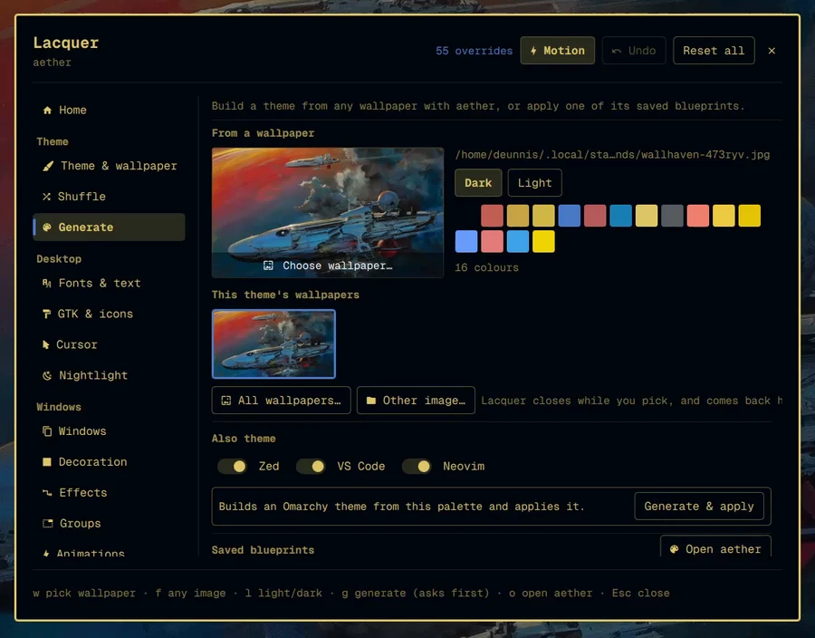
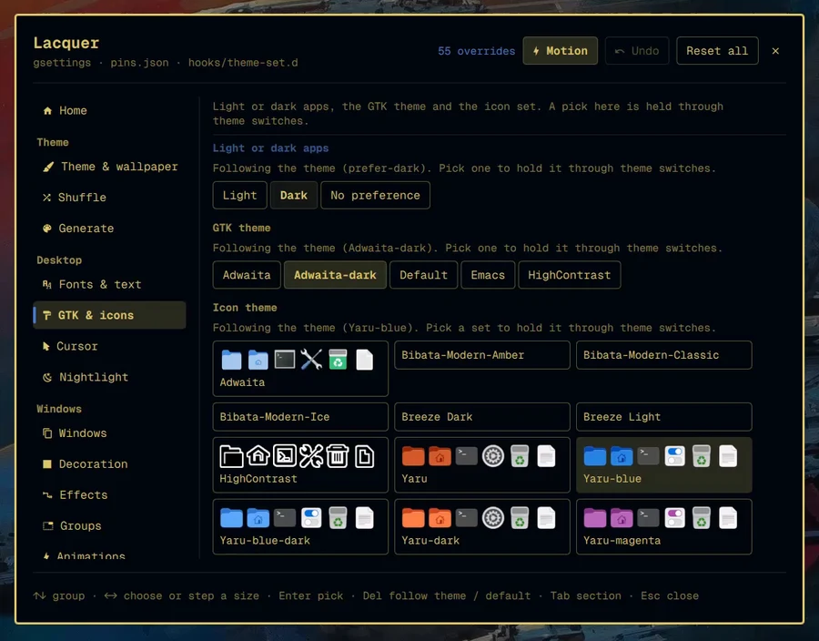
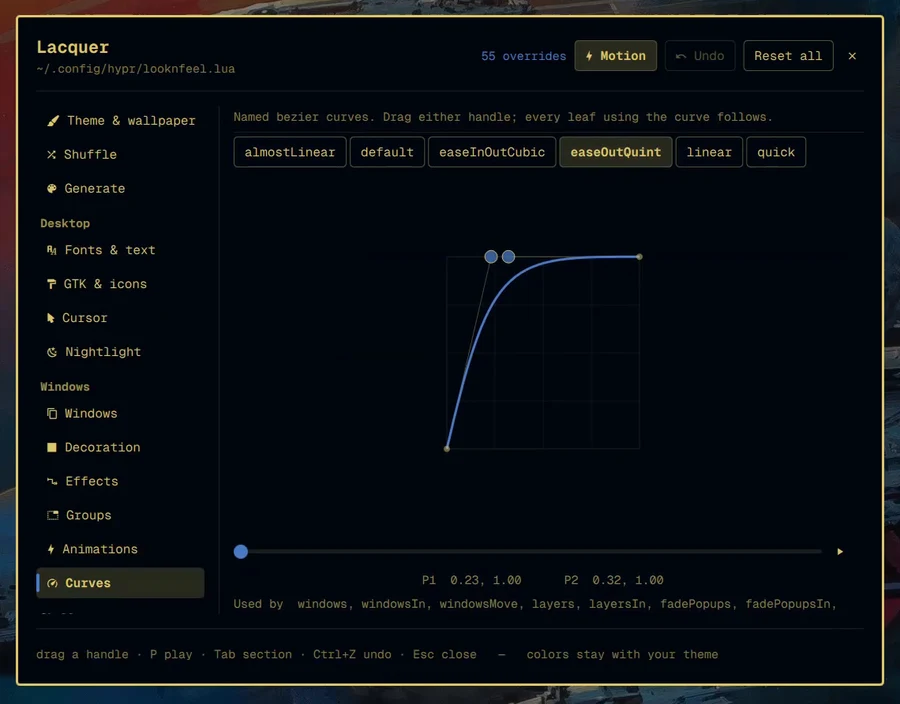
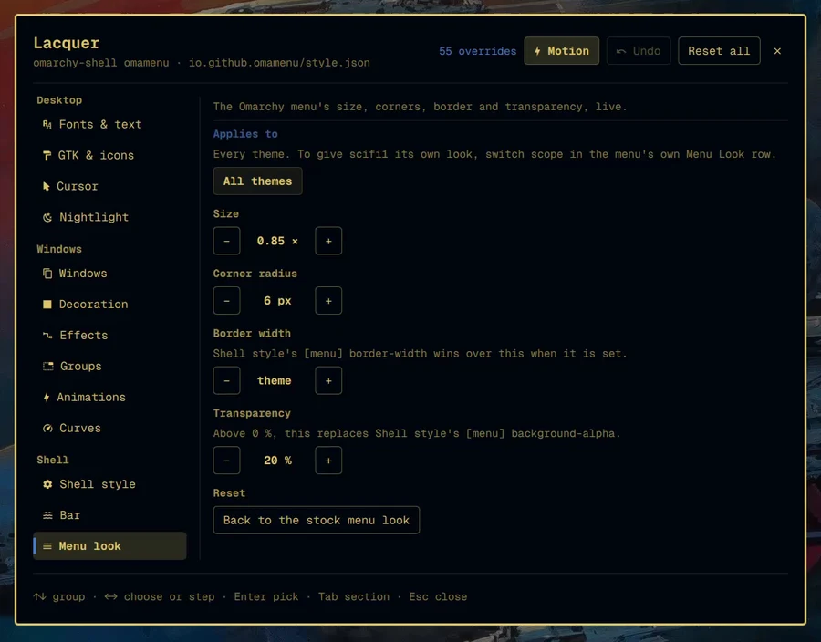

# Omarchy Lacquer

One app for how your Omarchy desktop looks.


[](https://github.com/Deunnis/omarchy-lacquer/releases/download/v0.3.0/lacquer-showcase.mp4)
<sub>▶ [Watch the 90-second tour](https://github.com/Deunnis/omarchy-lacquer/releases/download/v0.3.0/lacquer-showcase.mp4) (MP4, 17 MB)</sub>

| Group | Sections |
|---|---|
| Theme | Theme & wallpaper · Shuffle · Generate (aether) |
| Desktop | Fonts & text · GTK & icons · Cursor · Nightlight |
| Windows | Windows · Decoration · Effects · Groups · Animations · Curves |
| Shell | Shell style · Bar · Menu look |
| Screens | Lock & boot · Screensaver |
| Apps | Terminals · btop & prompt · Plugins |

<table>
<tr>
<td width="33%"><br><sub><b>Theme & wallpaper</b>: every theme and its wallpapers</sub></td>
<td width="33%"><br><sub><b>Shuffle</b>: a new theme every boot, or Day & Night</sub></td>
<td width="33%"><br><sub><b>Generate</b>: a theme from any wallpaper</sub></td>
</tr>
<tr>
<td><br><sub><b>GTK & icons</b>: pinned through theme switches</sub></td>
<td><br><sub><b>Curves</b>: drag a bezier, every animation follows</sub></td>
<td><br><sub><b>Menu look</b>: size, corners, border, transparency</sub></td>
</tr>
</table>

> **Beta.** Lacquer has so far been used on one laptop (1080p, one screen,
> foot, mostly light themes). If yours is different (several screens,
> scaling, a dark theme, kitty/ghostty/alacritty, no lock-explorer), please
> try it and [open an issue](https://github.com/Deunnis/omarchy-lacquer/issues/new/choose)
> for anything that breaks or looks wrong. Paste the output of
> `~/.config/omarchy/plugins/io.github.deunnis.lacquer/lacquer-report` with it.
> First-run backups and `lacquer-cleanup` (see [Remove](#remove)) are there so
> nothing is hard to undo.

## Install

    omarchy plugin add https://github.com/Deunnis/omarchy-lacquer --enable

Then open **Omarchy Lacquer** from the app launcher (`Super + Space`); the plugin
adds its own launcher entry. From a terminal or a keybinding:

    omarchy-shell shell toggle io.github.deunnis.lacquer
    omarchy-shell shell summon io.github.deunnis.lacquer '{"section":"cursor"}'

Update with `omarchy plugin update io.github.deunnis.lacquer`.

**What happens without you changing anything:** enabling the plugin adds its
launcher entry and a theme-switch hook (which does nothing until you pin a GTK
or icon choice). The first time the app opens it copies `looknfeel.lua`,
`shell.toml` and `shell.json` to `*.lacquer-backup-<time>`. Beyond that, only
a change you make writes anything, and the theme shuffle is off until you
turn it on.

### Requirements

- **Omarchy 4** (Quattro), with its Lua Hyprland config.
- Everything else Lacquer calls ships with Omarchy: `aether`, `jq`, `lua`,
  `python3`, `libvips`, `gsettings`, `hyprsunset`.

Optional, for one section each:

| Plugin | Adds |
|---|---|
| [lock-explorer](https://github.com/SirJul1337/omarchy-lock-explorer) | **Lock & boot**: designs, unlock animation, clock, boot screen. Without it the section says so. |
| [OmaMenu](https://github.com/Deunnis/OmaMenu) with Menu Look IPC | **Menu look**. Without it the section is not shown. |
| [OmaShuffle](https://github.com/Deunnis/OmaShuffle) | Nothing extra: while it is installed, Lacquer's Shuffle stays out of its way. |

## Remove

Lacquer's changes are ordinary config, so removing the plugin alone leaves
them in effect. To undo them first:

    ~/.config/omarchy/plugins/io.github.deunnis.lacquer/lacquer-cleanup         # shows what it would undo
    ~/.config/omarchy/plugins/io.github.deunnis.lacquer/lacquer-cleanup --yes   # undoes it
    omarchy plugin remove io.github.deunnis.lacquer

`lacquer-cleanup` removes Lacquer's blocks from `looknfeel.lua`, `hyprland.lua`
and `autostart.lua`, puts back Omarchy's `hyprsunset.conf` if Lacquer wrote
one, unpins GTK and icon choices, resets a saved cursor, and deletes its hook,
launcher entry and state. It lists, and leaves alone, what are ordinary
settings elsewhere: `shell.toml`/`shell.json` values, fonts and text size,
terminal/btop/starship lines, lock-explorer and OmaMenu settings, and the
backups. Skipping it is fine too: the launcher entry goes when the plugin is
disabled, and the hook deletes itself at the next theme switch.

Lacquer writes almost nothing itself. Wherever a tool already owns a setting —
`omarchy theme set`, `omarchy font set`, gsettings, `hyprctl`, aether's CLI,
lock-explorer's IPC, omamenu's IPC — Lacquer calls that tool. The files it
does write, it edits line by line in their own format, and every write path
was checked to put a file back byte-for-byte when a value is set back.

## Home

Lacquer opens on **Home** (a `section` in the summon payload opens elsewhere):

- **A live miniature of this desktop.** Your wallpaper and bar, windows drawn
  with your gaps, border width, rounding, opacity and theme accent, re-tiling
  every few seconds on your own `windowsMove` curve and speed, with a pointer
  following focus. Change a setting and the miniature follows.
- **The theme's palette** as soft discs drifting behind the page, and a
  swatch row that ripples.
- **Search across every setting** (310 today: look & feel rows, animation
  leaves, shell.toml tokens, and the groups of the Desktop, Screens and Apps
  views). Just start typing; Enter opens the section with the cursor on the
  match.
- **Every section with what it is set to right now**, in cards that rise in
  when Home opens.

Everything moving is paused whenever Home is not on screen. Measured on a
Ryzen 5 4500U laptop, any animation that runs at the display rate without pause costs about
12 % of a core, whatever it draws, so the drift and ripple are stepped at ~15
frames a second, the caret blinks without fading, and the miniature rests a
few seconds between re-tiles: Home costs about 7 % of one core while open.

## Motion

Switching sections glides the page in from the direction you moved along the
rail, with a fade and a small settle; the rail's accent marker slides and
stretches to the new entry; rows and groups cascade in; sub-tabs slide in
from the side.

**Motion** in the header (or `Ctrl+M`) turns every animation Lacquer draws on
or off: transitions, the rail marker, cascades, Home's live miniature, palette
and blinking caret, and the rows' fades. It is saved in
`~/.local/state/omarchy/io.github.deunnis.lacquer/ui.json`. With it off, Home costs no
more than a closed panel. Two things are not covered: the curve preview's Play
button (it is the feature), and the hover fades built into Omarchy's own
buttons, which Lacquer does not own.

## Coming from Omaland or OmaShuffle

**[Omaland](https://github.com/bobby-nicholas/omaland)** also writes look and
feel into `looknfeel.lua`. When Lacquer finds Omaland's block it shows a banner
and does nothing else. **Import settings** (`Ctrl+I`) copies Omaland's values into
Lacquer's own block (on top of anything already set in Lacquer) and removes
Omaland's block. **Uninstall Omaland** asks again before running
`omarchy plugin remove`. **Not now** hides the banner for the session. Keeping
both installed works, but for a setting both of them change, whichever block
comes later in `looknfeel.lua` is the one Hyprland uses.

**[OmaShuffle](https://github.com/Deunnis/OmaShuffle)**: see Shuffle below.

## How changes apply

Live, with undo. Nothing to press.

| | |
|---|---|
| during a drag | `hyprctl eval` only — nothing touches disk |
| on release | debounced write of the block, then `hyprctl reload` |

That split is why dragging a slider does not fire dozens of reloads. Every row
has a reset-to-default and every section a reset.

**`Ctrl+Z` covers `looknfeel.lua` and `shell.toml`** — the two files Lacquer
owns outright. It deliberately does *not* cover `shell.json`: the bar layout
and plugin settings are also written by the `omarchy` CLIs and by the shell
itself, and replaying a whole-file snapshot over that would clobber changes
Lacquer never made. Undo a bar or plugin change by changing it back.

`hyprctl keyword` is not usable — Hyprland rejects it under the Lua parser
("keyword can't work with non-legacy parsers, use eval").

## Backups

Live apply means a mistake reaches disk, so the first time Lacquer ever runs
it snapshots the three files it can write:

    ~/.config/hypr/looknfeel.lua.lacquer-backup-<timestamp>
    ~/.config/omarchy/shell.toml.lacquer-backup-<timestamp>
    ~/.config/omarchy/shell.json.lacquer-backup-<timestamp>

Once only — a marker in `~/.local/state/omarchy/` — so the snapshot is of the
state *before* Lacquer, not of whatever it wrote yesterday. If a migration is
due, it waits for the backup to finish rather than racing it, so the snapshot
always shows the world as it was.

## Theme & wallpaper

Every installed theme with a `colors.toml` (an empty folder such as a half-made
`themes/aether` would apply a broken theme, so it is hidden), with previews and
a palette strip, and the active theme's wallpapers. Picking applies through
`omarchy theme set` / `omarchy theme bg set`.

## Shuffle

OmaShuffle's engine, carried over: a new theme on every real boot, or Day &
Night themes that follow sunrise and sunset. It runs in `Service.qml`, so it
works with Lacquer closed. State lives in
`~/.local/state/omarchy/io.github.deunnis.lacquer/shuffle.json`.

**While `io.github.omashuffle` is installed, Lacquer's engine stays dormant**
so the two never both switch the theme on the same boot or sunset. The
section's "Move to Lacquer" button removes OmaShuffle — only when pressed and
confirmed — and only then does the engine adopt its state, including the last
boot id, so the restart that follows is not counted as a boot. Uninstalling
OmaShuffle any other way does not switch the shuffle on in Lacquer. On a fresh
install the shuffle is **off** until you turn it on.

Two upstream quirks are fixed in the copy: a manual latitude of `null` no
longer becomes 0, and a theme applied from outside the engine now clears a
stale manual pick.

## Generate

aether, driven by its CLI. Choose the source by clicking the preview or
**All wallpapers…** (`w`), which opens Omarchy's own image picker with every
installed theme's wallpapers, or **Other image…** (`f`), the desktop file
chooser. Lacquer closes while you pick and comes back on Generate with your
choice. The palette preview uses `--extract-palette` and changes nothing. **Generate & apply** runs `aether --generate`, which switches
the whole desktop to a theme called `aether` and, unless unticked, writes theme
files into Zed, VS Code and Neovim — so it asks twice. Saved blueprints apply
with `--apply-blueprint`; everything else is one click away in aether itself.

## Desktop

| | applied with | survives a theme switch |
|---|---|---|
| Text size | `omarchy display text size` | yes |
| Terminal font | `omarchy font set` (restarts the shell; Lacquer reopens where it was) | yes |
| Interface font | gsettings `font-name` | yes |
| Light/dark apps, GTK theme, icons | gsettings, **pinned** | only when pinned |
| Cursor | `hyprctl setcursor` + gsettings + Lacquer's block in `hypr/autostart.lua` | yes |
| Nightlight | `hypr/hyprsunset.conf` + autostart | yes |

Every theme switch resets the GTK theme, colour scheme and icons to what the
theme asks for. A pick in GTK & icons is a **pin**: it is kept in `pins.json`
and put back by `~/.config/omarchy/hooks/theme-set.d/lacquer-reapply` after
the switch. Anything not picked keeps following the theme; `Del` (or
**Follow theme**) unpins. The hook deletes itself if Lacquer is uninstalled.

Two Omarchy quirks are worked around, not changed:

- `omarchy font set` sets foot back to 9 pt and its alacritty substitution is
  greedy, eating `style = "Bold"` from one-line font tables. Lacquer restores
  foot's size and rewrites the family inside its quotes only.
- Text size re-derives every terminal's size from the px value, so the section
  says what a step will set terminals to before you press it.

The cursor and nightlight autostart share a second fenced block, in
`~/.config/hypr/autostart.lua` rather than `hyprland.lua`, so it never shares a
file with the window-rule block written from Lacquer's in-memory state.

Turning the nightlight schedule off puts Omarchy's shipped
`hyprsunset.conf` back exactly. A hand-written schedule is left alone unless
you choose to replace it (a backup is kept).

## Screens

Lock and boot settings go through **lock-explorer's IPC only**
(`omarchy-shell lock …`). Its `shell.json` entry is never edited directly: its
in-memory settings win over the file and it rewrites the whole entry.
Choosing a boot screen only marks it; building it needs your password and
happens behind lock-explorer's own Apply button, which Lacquer opens rather
than re-implementing, so lock-explorer's record of what is baked stays true.

Idle timings (`idle.screensaver`, `idle.lock`) are set in `shell.json` from a
fresh read, touching only that key. Screensaver and About art use
`omarchy branding`.

## Menu look

OmaMenu's size, corners, border and transparency, set through an `omamenu` IPC
target (`look`, `setLook`, `resetLook`) in `io.github.omamenu`. The section only
appears when OmaMenu answers on it. The
menu keeps its own file and write guarantees; Lacquer only sends values. Menu
look's transparency replaces Shell style's `[menu] background-alpha` while it
is above 0 %.

## Apps

Terminal padding, cursor and background opacity go to every installed terminal
(foot, alacritty, kitty, ghostty) in each file's own format; font and size stay
with Fonts & text. btop's drawing options reload a running btop with SIGUSR2;
`color_theme` is never touched. Starship's spacing and command timeout apply to
the next prompt. A theme switch never rewrites any of these files.

## The managed block

Lacquer owns exactly what sits between its fences in
`~/.config/hypr/looknfeel.lua`:

```lua
-- >>> lacquer managed block >>>
-- <<< lacquer managed block <<<
```

It re-reads the block every time it opens and only ever rewrites what is
between the fences, so hand-editing is safe. If the block cannot be read —
a syntax error, say — Lacquer says so and **refuses to write**, rather than
treating it as empty and replacing your edit with nothing. Calls it does not
recognise are no-ops, so adding a keybind or a launcher line to the block does
not make it unreadable. Only values that differ from
Omarchy's shipped defaults are written, and an empty block is removed rather
than left as a husk.

**Full opacity** is the one setting that needs a second file. Omarchy tags every
window with `opacity "0.985 0.96"` in `default/hypr/windows.lua`, which
multiplies with the `decoration:*_opacity` globals and stops those sliders ever
reaching 1.0. Cancelling it means a window rule, and window rules belong in
`~/.config/hypr/hyprland.lua` — so Lacquer keeps a second managed block there,
holding nothing but that rule. Both files are written before a single
`hyprctl reload`, so Hyprland never reads a half-written pair.

Omarchy's defaults are read by running
`$OMARCHY_PATH/default/hypr/looknfeel.lua` through `read.lua`, a set of
recording stubs. Lua reading Lua, so there is no second grammar to keep in sync.

## Shell styling

The **Shell** section edits `~/.config/omarchy/shell.toml` — the surface that
restyles the bar, menus, popups, tooltips, notifications, the launcher, the
lock screen and every control in them. Omarchy ships no UI for any of it.

Four sub-tabs (`[` and `]` to move between them):

| | |
|---|---|
| Text | base size plus every per-token font pin |
| Spacing | the scale, and all 25 spacing tokens |
| Controls | border, fill and focus chrome in each state |
| Surfaces | the bar and all nine overlay surfaces |

These apply **with no restart** — the shell watches the file — and user keys
beat the active theme's own `shell.toml`, so they survive a theme switch.

Which is exactly why **colour rows are marked**. Pinning a colour means a theme
change can no longer move it, and colour belongs to the theme. A pinned colour shows a `pins theme` chip and a one-click clear;
structural rows carry no such tension and are unmarked.

A key the theme does not ship falls back to Omarchy's documented default from
`shell.toml.tpl`, not to the slider's minimum — many keys ship commented out,
and showing the minimum would be a number that is simply untrue.

Editing is line-based, not a TOML round-trip: comments, key order, alignment
and anything Lacquer does not understand survive untouched, because this file
is shared with `omarchy display text size` and with hand edits.

## Bar

Position, transparency, and a layout editor for all three sections. Each widget
shows its friendly name and id with controls to move it between sections,
reorder it, or take it off the bar.

Bar height and colours are **not** here — they belong to `shell.toml` and live
under Shell → Surfaces, so there is one place for each thing rather than two.

## Plugins

A settings editor for every installed plugin, built from the `schema` block in
its own manifest. Omarchy 4.0.3 renders these nowhere: the shell carries
`schema`, `defaults` and `settingsForm` as registry metadata and every control
they imply exists in `qs.Ui`, but nothing joins the two.

| Schema type | Control |
|---|---|
| `boolean` | switch |
| `integer`, `number` with `min`+`max` | slider |
| `integer`, `number` without bounds | text field, refusing non-numbers |
| `string`, `path` | text field |
| `enum` | dropdown |
| `array`, `multiselect` | text field taking JSON, refusing invalid JSON |

Manifests are read straight off disk rather than from the host's registry
snapshot, because that snapshot only covers bar widgets — panel, service and
overlay plugins carry settings too.

## How the bar and plugin settings are written

A plugin may only write its **own** settings through the shell API: `shell.qml`'s
`_updateSettings` requires `pluginHasBarCapabilities()`, which means declaring
`kind: "bar"` — replacing the user's entire bar. Lacquer does not do that. So:

| | |
|---|---|
| bar widgets, layout, position, transparency | the `omarchy bar` and `omarchy plugin` CLIs |
| plugins that are not on the bar | a guarded direct write to `shell.json` |

The direct write re-parses the file each time rather than holding a copy, so a
change made by the shell or the CLI in between is never clobbered, and it
serialises to the same shape already on disk so a write is not a reformat.

## Animations

Every leaf Hyprland exposes, grouped the way its animation tree is shaped, with
speed, curve and style. Speed is a **duration in deciseconds** — bigger is
slower — and each row shows the millisecond equivalent.

A leaf Omarchy ships no value for inherits from its parent. Hyprland reports
those as "not overridden" rather than resolving them, so Lacquer shows them as
inherited instead of inventing a number; **Override** materialises the leaf from
the nearest ancestor that has real values.

## Curves

A cubic bezier with both endpoints pinned at (0,0) and (1,1), which is what
Hyprland's `bezier` is. Only the two control handles move. The unit square is
drawn square with room above and below, because curves legitimately overshoot.

The play strip runs the same four numbers through QML's `Easing.Bezier` for the
real duration of a leaf using that curve, so you can feel the timing without
opening a window.

Hyprland keeps a curve in its name table once defined, so a curve added at
runtime lingers until Hyprland restarts. Lacquer only edits curves that
already exist.

## Keys

| | |
|---|---|
| type | on Home: search every setting |
| `↑ ↓` / `k j` | move between rows (Desktop, Screens, Apps: between groups; Home: sections) |
| `← →` / `h l` | adjust the focused row |
| `Space` | toggle a switch |
| `Backspace` | reset the row to Omarchy's default; in Desktop, unpin |
| `Enter` | apply the chosen theme or choice |
| `l` `g` `o` | Generate: light/dark, generate (asks first), open aether |
| `Tab` / `Shift+Tab` | change section |
| `[` / `]` | change sub-tab, or pick a plugin |
| `P` | play the curve preview |
| `Ctrl+Z` | undo |
| `Ctrl+M` | app animations on/off |
| `Ctrl+I` | import Omaland's settings, while its banner is showing |
| `Esc` | close |

Hovering a row moves the keyboard cursor to it.

## Notes

`pkill hyprsunset` returns before the old instance lets go of the display, and
a new one started in that window exits at once; the `nightlight` helper waits
for the old process to be gone and checks the new one stays up.

A plugin cannot ask the host where it lives: since 4.0.3 `shell.qml`'s
`publicPluginManifest()` deletes `__sourceDir` from every third-party manifest,
so the plugin directory comes from `Qt.resolvedUrl(".")` instead.

## Files

| | |
|---|---|
| `Panel.qml` | the app: state, live preview, persistence, undo, Omaland import |
| `ConfigRow.qml` | one look-and-feel option |
| `LeafRow.qml` | one animation leaf |
| `CurveEditor.qml` | the bezier graph and play strip |
| `ShellRow.qml` | one shell.toml option, with the colour warning |
| `SettingRow.qml` | one plugin setting, control chosen from its schema type |
| `LookSchema.js` | the catalogue of look-and-feel options |
| `ShellSchema.js` | the catalogue of shell.toml options |
| `TomlEdit.js` | comment-preserving line editor for shell.toml |
| `scan-plugins.py` | reads every installed plugin manifest off disk |
| `AnimSchema.js` | the catalogue of animation leaves |
| `StyleLua.js` | renders and parses the managed block |
| `read.lua` | recording stubs that report what a Lua chunk declares |
| `Service.qml` | launcher entry, theme-set hook, Shuffle engine, reopen after a font restart |
| `stores/` | one non-visual store per area: Hypr, ShellToml, ShellJson, Theme, ShuffleEngine, Aether, Desktop, Night, Screens, MenuLook, Apps |
| `sections/HomeSection.qml` | Home: miniature, palette, search index, summary cards |
| `sections/` | one view per pane; `ChoicePane.qml` renders the chip, stepper, icon, font, art and card groups shared by Desktop, Screens and Apps |
| `ShuffleDeck.js`, `SunTimes.js` | OmaShuffle's deck and sunrise maths |
| `scan-themes`, `scan-wallpapers`, `scan-desktop`, `scan-screens` | read-only scanners |
| `desktop-block` | owns the fenced block in `hypr/autostart.lua` |
| `nightlight` | hyprsunset schedule and temperature |
| `app-config` | terminal, btop and starship line edits |
| `shell-json-set` | one top-level `shell.json` key from a fresh read |
| `lacquer-reapply.hook` | copied into `hooks/theme-set.d/` |
| `lacquer-cleanup` | undoes Lacquer's changes before removal |
| `lacquer-report` | prints setup details and recent log lines for a bug report |

## Credits

`LookSchema.js`, `ConfigRow.qml` and the `hl.config` rendering in `StyleLua.js`
are adapted from **Omaland** by Bobby Nicholas (MIT) —
https://github.com/bobby-nicholas/omaland. See `LICENSE`.

The Shuffle engine, `ShuffleDeck.js`, `SunTimes.js` and `scan-themes` come from
**OmaShuffle** (MIT, Deunnis).
